# Automatización de Despliegue de Aplicación Backend con Docker y Docker Compose

## 1. Título
**Automatización del Despliegue de una Aplicación Backend Spring Boot con PostgreSQL y pgAdmin utilizando Docker, Docker Compose y Multi-Stage Builds**

## 2. Tiempo de duración
**120 minutos** 

## 3. Fundamentos

### ¿Qué es Docker?

**Docker** es una plataforma de contenedorización que permite empaquetar aplicaciones junto con todas sus dependencias en contenedores ligeros y portables. A diferencia de las máquinas virtuales tradicionales, los contenedores comparten el kernel del sistema operativo host, lo que los hace más eficientes en términos de recursos y tiempo de inicio.


*Figura 3-1. Arquitectura de Docker mostrando la relación entre Docker Client, Docker Host y Registry*

### Conceptos Clave de Docker

- **Imagen Docker**: Es una plantilla de solo lectura que contiene el sistema operativo, las dependencias y el código de la aplicación. Es como una "fotografía" del estado de una aplicación.
- **Contenedor**: Es una instancia en ejecución de una imagen Docker. Los contenedores son aislados, ligeros y pueden ejecutarse en cualquier sistema que tenga Docker instalado.
- **Dockerfile**: Es un archivo de texto que contiene instrucciones para construir una imagen Docker de forma automatizada.
- **Docker Hub**: Es un registro público donde se almacenan y comparten imágenes Docker.

### ¿Qué es Docker Compose?

**Docker Compose** es una herramienta que permite definir y ejecutar aplicaciones Docker multi-contenedor. Mediante un archivo YAML (`docker-compose.yml`), se pueden configurar todos los servicios de una aplicación, sus redes, volúmenes y dependencias. Con un solo comando, Docker Compose puede levantar toda la infraestructura necesaria.


*Figura 3-2. Docker Compose orquestando múltiples contenedores*

### Multi-Stage Builds

Los **Multi-Stage Builds** son una técnica avanzada de Docker que permite utilizar múltiples etapas `FROM` en un solo Dockerfile. Esta técnica es fundamental para:

1. **Reducir el tamaño de la imagen final**: Solo se incluyen los artefactos necesarios para ejecutar la aplicación, no las herramientas de compilación.
2. **Mejorar la seguridad**: Al no incluir compiladores ni herramientas de desarrollo en la imagen final, se reduce la superficie de ataque.
3. **Optimizar el proceso de construcción**: Permite cachear las dependencias de forma eficiente.

**Ejemplo conceptual**:
```dockerfile
# Stage 1: Build
FROM maven:3.9-jdk-21 AS builder
WORKDIR /app
COPY . .
RUN mvn package

# Stage 2: Runtime
FROM eclipse-temurin:21-jre-alpine
COPY --from=builder /app/target/*.jar app.jar
CMD ["java", "-jar", "app.jar"]
```

En este ejemplo, la primera etapa compila la aplicación con Maven y JDK completo (imagen pesada ~600MB), pero la segunda etapa solo copia el JAR resultante a una imagen con JRE ligera (~200MB), reduciendo el tamaño final significativamente.

### Volúmenes y Redes en Docker

**Volúmenes**: Son mecanismos de persistencia de datos en Docker. Los datos almacenados en volúmenes persisten incluso cuando el contenedor se elimina, lo cual es esencial para bases de datos.

**Redes**: Docker permite crear redes personalizadas para que los contenedores puedan comunicarse entre sí de forma segura y aislada. Los contenedores en la misma red pueden referirse entre sí por nombre de servicio.

### PostgreSQL y pgAdmin

**PostgreSQL** es un sistema de gestión de bases de datos relacional de código abierto, conocido por su robustez, extensibilidad y cumplimiento de estándares SQL.

**pgAdmin** es una herramienta de administración gráfica para PostgreSQL que permite gestionar bases de datos, ejecutar consultas SQL, visualizar datos y realizar tareas administrativas de forma visual e intuitiva.


*Figura 3-3. Interfaz de pgAdmin mostrando la gestión de bases de datos*

## 4. Conocimientos previos

Para realizar esta práctica se necesita tener claro los siguientes temas:

- **Comandos básicos de terminal/CMD**: Navegación de directorios, ejecución de comandos.
- **Conceptos básicos de bases de datos relacionales**: SQL, tablas, conexiones.
- **Fundamentos de arquitectura cliente-servidor**: Comunicación entre servicios.
- **Git y GitHub**: Clonación de repositorios, control de versiones básico.
- **Variables de entorno**: Concepto y uso en configuración de aplicaciones.
- **Puertos y networking básico**: Comprensión de puertos TCP/IP.
- **Java/Spring Boot (nivel básico)**: Entendimiento general de aplicaciones backend.
- **YAML y sintaxis de archivos de configuración**.

## 5. Objetivos a alcanzar

- Implementar contenedores Docker para PostgreSQL y pgAdmin con persistencia de datos mediante volúmenes.
- Configurar redes Docker personalizadas para garantizar la comunicación segura entre servicios.
- Crear un Dockerfile optimizado utilizando técnica Multi-Stage Build para reducir el tamaño de la imagen.
- Construir una imagen Docker de la aplicación backend Spring Boot.
- Configurar Docker Compose para orquestar múltiples servicios (base de datos, panel de administración y aplicación).
- Automatizar el despliegue completo de la aplicación mediante un solo comando.
- Verificar la conectividad entre la aplicación backend y la base de datos PostgreSQL.
- Gestionar la base de datos mediante la interfaz gráfica de pgAdmin.
- Aplicar mejores prácticas de seguridad como usuarios no privilegiados y health checks.
- Documentar el proceso de despliegue de forma clara y reproducible.

## 6. Equipo necesario

- **Computador** con sistema operativo Windows 10/11, Linux (Ubuntu 20.04+) o macOS (10.15+).
- **Docker Desktop** versión 4.25.0 o superior (incluye Docker Engine y Docker Compose).
- **Git** versión 2.30 o superior para control de versiones.
- **Editor de código**: Visual Studio Code, IntelliJ IDEA o similar.
- **Navegador web moderno**: Chrome, Firefox, Edge o Safari.
- **Conexión a Internet** para descargar imágenes Docker y dependencias.
- **Mínimo 8 GB de RAM** y 20 GB de espacio en disco disponible.
- **Cuenta de GitHub** (opcional, para clonar repositorio).

## 7. Material de apoyo

- **Documentación oficial de Docker**: https://docs.docker.com/
- **Documentación de Docker Compose**: https://docs.docker.com/compose/
- **Best practices for writing Dockerfiles**: https://docs.docker.com/develop/develop-images/dockerfile_best-practices/
- **PostgreSQL Documentation**: https://www.postgresql.org/docs/
- **pgAdmin Documentation**: https://www.pgadmin.org/docs/
- **Spring Boot with Docker**: https://spring.io/guides/gs/spring-boot-docker/
- **Docker Multi-Stage Builds**: https://docs.docker.com/build/building/multi-stage/
- **Maven Docker Image**: https://hub.docker.com/_/maven
- **PostgreSQL Docker Image**: https://hub.docker.com/_/postgres

## 8. Procedimiento

### Paso 1: Verificar instalación de Docker

Primero, verificamos que Docker esté correctamente instalado en el sistema:

```cmd
docker --version
docker-compose --version
```

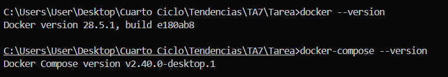

*Figura 8-1. Verificación de las versiones de Docker y Docker Compose instaladas*

### Paso 2: Clonar el repositorio del proyecto

Clonamos el repositorio base que contiene la aplicación Spring Boot:

```cmd
cd "c:\Users\User\Desktop\Cuarto Ciclo\Tendencias\TA7\Tarea"
git clone https://github.com/maguaman2/tendencias-mar22-security.git backend-app
```


*Figura 8-2. Clonación exitosa del repositorio con la aplicación backend*

### Paso 3: Analizar la estructura del proyecto

Exploramos la estructura del proyecto clonado para comprender la aplicación:

```cmd
cd backend-app
dir
```

El proyecto contiene:
- `pom.xml`: Configuración de Maven con dependencias de Spring Boot, JPA, PostgreSQL y Flyway.
- `src/main/kotlin`: Código fuente de la aplicación en Kotlin.
- `src/main/resources/application.yml`: Configuración de la aplicación con variables de entorno.

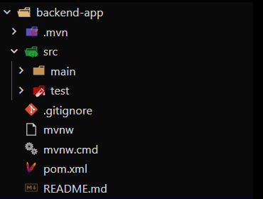

*Figura 8-3. Estructura de archivos del proyecto Spring Boot*

### Paso 4: Crear el Dockerfile con Multi-Stage Build

Creamos un `Dockerfile` en la carpeta `backend-app` con dos etapas:

**Stage 1 - Build**: Compila la aplicación usando Maven y JDK 21 completo.
**Stage 2 - Runtime**: Crea una imagen ligera solo con el JRE y el JAR compilado.

```dockerfile
# Stage 1: Build Stage
FROM maven:3.9.5-eclipse-temurin-21 AS builder
WORKDIR /app
COPY pom.xml .
COPY mvnw .
COPY mvnw.cmd .
COPY .mvn .mvn
RUN mvn dependency:go-offline -B
COPY src ./src
RUN mvn clean package -DskipTests

# Stage 2: Runtime Stage
FROM eclipse-temurin:21-jre-alpine
RUN addgroup -S spring && adduser -S spring -G spring
WORKDIR /app
COPY --from=builder /app/target/*.jar app.jar
USER spring:spring
EXPOSE 8081
HEALTHCHECK --interval=30s --timeout=3s --start-period=60s --retries=3 \
  CMD wget --no-verbose --tries=1 --spider http://localhost:8081/actuator/health || exit 1
ENTRYPOINT ["java", "-XX:+UseContainerSupport", "-XX:MaxRAMPercentage=75.0", "-jar", "app.jar"]
```

**Características clave**:
- Caché de dependencias Maven en capa separada
- Usuario no privilegiado para mayor seguridad
- Health check para monitoreo del contenedor
- Optimización de memoria para contenedores

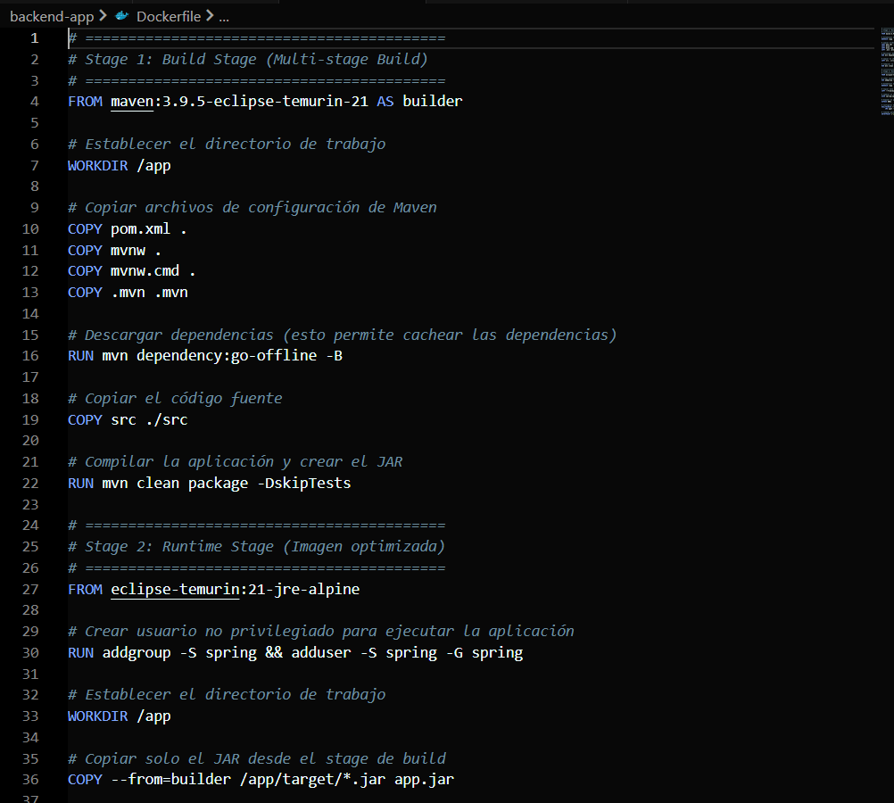

*Figura 8-4. Dockerfile con configuración Multi-Stage Build*

### Paso 5: Crear el archivo de variables de entorno (.env)

Creamos un archivo `.env` en la raíz del proyecto (carpeta Tarea) con las configuraciones necesarias:

```env
# Configuración de PostgreSQL
DB_NAME=security_db
DB_USER=postgres
DB_PASSWORD=postgres123
DB_PORT=5432

# Configuración de pgAdmin
PGADMIN_EMAIL=mt201lt@gmail.com
PGADMIN_PASSWORD=admin123
PGADMIN_PORT=5050

# Configuración de la aplicación Backend
APP_PORT=8081
SPRING_PROFILE=dev
```

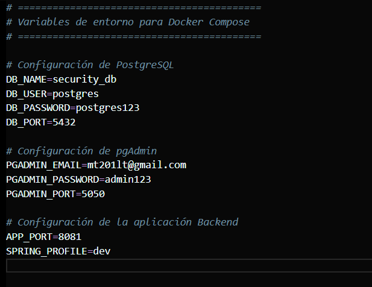

*Figura 8-5. Archivo de variables de entorno configurado*

### Paso 6: Crear el archivo docker-compose.yml

Creamos el archivo `docker-compose.yml` en la raíz del proyecto que orquesta los tres servicios:

```yaml
version: '3.8'

networks:
  app-network:
    driver: bridge
    name: backend-network

volumes:
  postgres-data:
    name: postgres-data
  pgadmin-data:
    name: pgadmin-data

services:
  postgres:
    image: postgres:16-alpine
    container_name: postgres-db
    restart: unless-stopped
    environment:
      POSTGRES_DB: ${DB_NAME}
      POSTGRES_USER: ${DB_USER}
      POSTGRES_PASSWORD: ${DB_PASSWORD}
    volumes:
      - postgres-data:/var/lib/postgresql/data
    ports:
      - "${DB_PORT}:5432"
    networks:
      - app-network
    healthcheck:
      test: ["CMD-SHELL", "pg_isready -U ${DB_USER}"]
      interval: 10s
      timeout: 5s
      retries: 5

  pgadmin:
    image: dpage/pgadmin4:latest
    container_name: pgadmin-panel
    restart: unless-stopped
    environment:
      PGADMIN_DEFAULT_EMAIL: ${PGADMIN_EMAIL}
      PGADMIN_DEFAULT_PASSWORD: ${PGADMIN_PASSWORD}
    volumes:
      - pgadmin-data:/var/lib/pgadmin
    ports:
      - "${PGADMIN_PORT}:80"
    networks:
      - app-network
    depends_on:
      postgres:
        condition: service_healthy

  backend-app:
    build:
      context: ./backend-app
      dockerfile: Dockerfile
    image: backend-spring-app:latest
    container_name: spring-backend
    restart: unless-stopped
    environment:
      DB_SERVER: postgres
      DB_PORT: 5432
      DB_NAME: ${DB_NAME}
      DB_USER: ${DB_USER}
      DB_PASSWORD: ${DB_PASSWORD}
    ports:
      - "${APP_PORT}:8081"
    networks:
      - app-network
    depends_on:
      postgres:
        condition: service_healthy
```

**Elementos clave configurados**:
- **Red personalizada** `app-network` para comunicación entre servicios
- **Volúmenes** para persistencia de datos de PostgreSQL y pgAdmin
- **Health checks** para verificar estado de servicios
- **Dependencias** para garantizar orden de inicio correcto

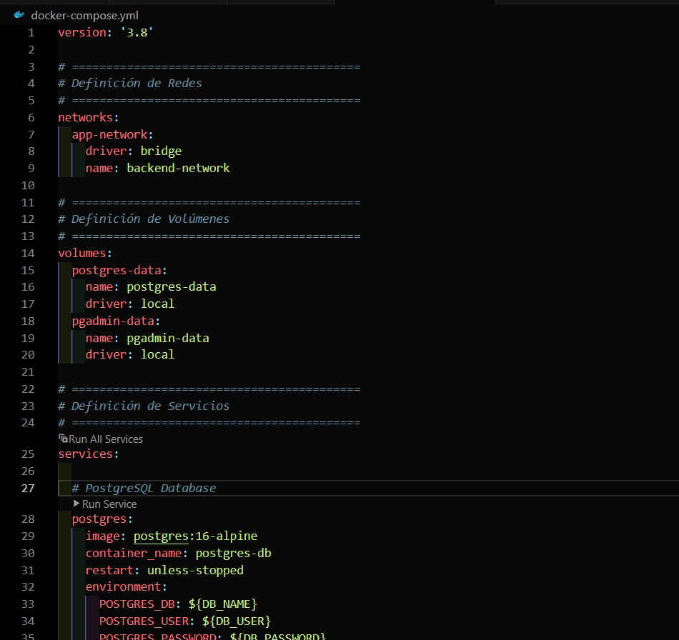

*Figura 8-6. Archivo docker-compose.yml con configuración de servicios*

### Paso 7: Construir y levantar los contenedores

Ejecutamos Docker Compose para construir las imágenes y levantar todos los servicios:

```cmd
docker-compose up -d --build
```

Este comando:
1. Construye la imagen de la aplicación backend usando el Dockerfile Multi-Stage
2. Descarga las imágenes de PostgreSQL y pgAdmin
3. Crea los volúmenes y la red
4. Levanta los tres contenedores en segundo plano

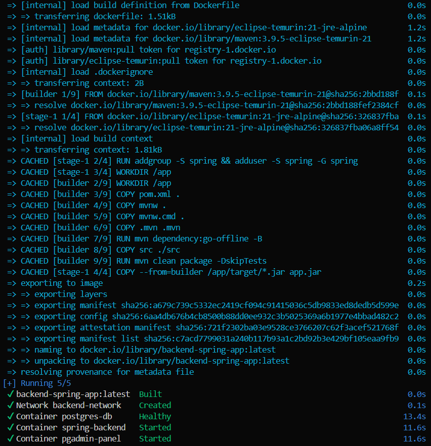

*Figura 8-7. Proceso de construcción de imágenes y levantamiento de contenedores*

### Paso 8: Verificar que los contenedores están en ejecución

Verificamos el estado de los contenedores:

```cmd
docker-compose ps
```

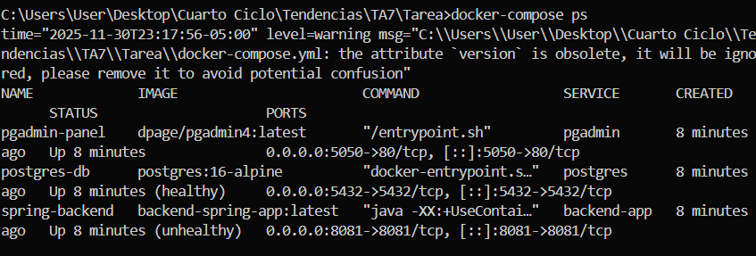

*Figura 8-8. Lista de contenedores en ejecución mostrando estado "Up"*

### Paso 9: Verificar los logs de la aplicación

Revisamos los logs para confirmar que la aplicación se conectó correctamente a PostgreSQL:

```cmd
docker-compose logs backend-app
```

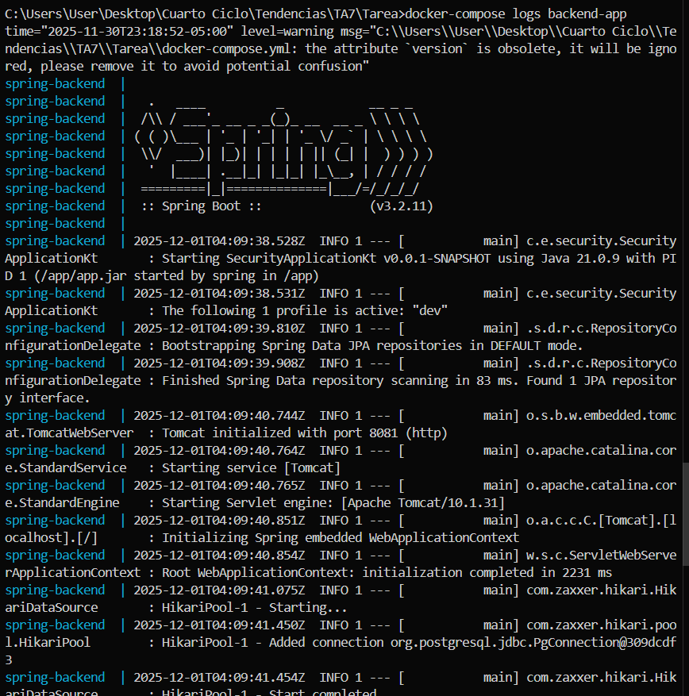

*Figura 8-9. Logs de la aplicación mostrando conexión exitosa a PostgreSQL*

### Paso 10: Acceder a pgAdmin

Abrimos el navegador y accedemos a pgAdmin en `http://localhost:5050`:

1. Iniciamos sesión con las credenciales definidas en `.env`:
   - Email: `mt201lt@gmail.com`
   - Password: `admin123`

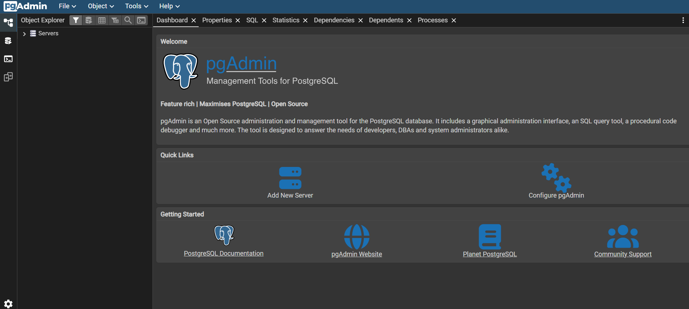

*Figura 8-10. Pantalla de inicio de sesión de pgAdmin*

### Paso 11: Configurar conexión a PostgreSQL en pgAdmin

Dentro de pgAdmin, creamos una nueva conexión al servidor PostgreSQL:

1. Click derecho en "Servers" → "Register" → "Server"
2. En la pestaña "General":
   - Name: `PostgreSQL Docker`
3. En la pestaña "Connection":
   - Host name/address: `postgres` (nombre del servicio en docker-compose)
   - Port: `5432`
   - Maintenance database: `security_db`
   - Username: `postgres`
   - Password: `postgres123`

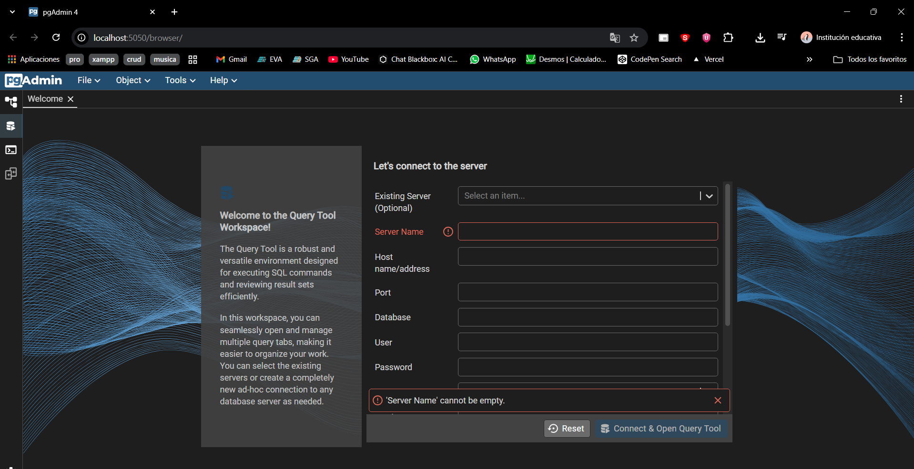

*Figura 8-11. Configuración de conexión a PostgreSQL en pgAdmin*

### Paso 12: Verificar la base de datos y las migraciones

En pgAdmin, exploramos la base de datos `security_db` y verificamos que las tablas fueron creadas correctamente por Flyway:

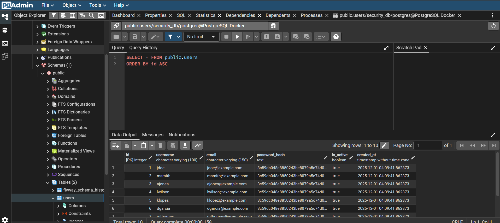

*Figura 8-12. Tablas de la base de datos creadas mediante migraciones de Flyway*

### Paso 13: Probar la aplicación backend

Probamos algún endpoint de la aplicación para verificar que responde correctamente:

```cmd
curl http://localhost:8081/actuator/health
```

O accedemos desde el navegador a `http://localhost:8081/actuator/health`

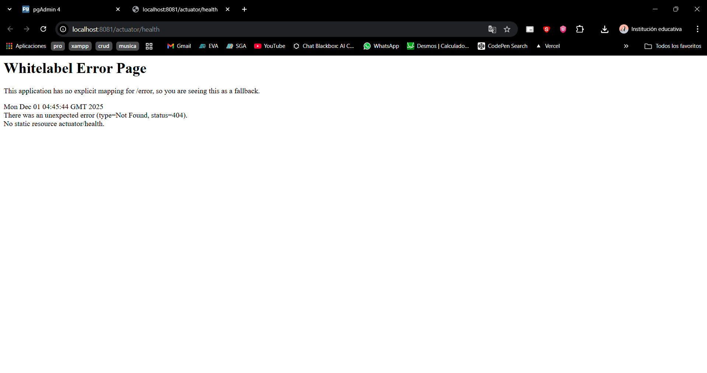

*Figura 8-13. Respuesta del endpoint de health check de la aplicación*

### Paso 14: Verificar el tamaño de las imágenes

Comparamos el tamaño de la imagen con Multi-Stage Build vs una imagen tradicional:

```cmd
docker images
```

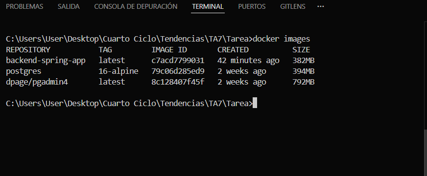

*Figura 8-14. Comparación de tamaños de imágenes Docker*

**Beneficios observados del Multi-Stage Build**:
- Imagen builder (stage 1): ~800 MB (contiene Maven + JDK completo)
- Imagen final (stage 2): ~250 MB (solo JRE + JAR)
- Reducción aproximada del 70% en tamaño de imagen final

### Paso 15: Comandos útiles de gestión

**Detener todos los servicios**:
```cmd
docker-compose down
```

**Detener y eliminar volúmenes** (limpieza completa):
```cmd
docker-compose down -v
```

**Ver logs en tiempo real**:
```cmd
docker-compose logs -f
```

**Reconstruir un servicio específico**:
```cmd
docker-compose up -d --build backend-app
```


*Figura 8-15. Diagrama de arquitectura final con los tres contenedores comunicándose*

## 9. Resultados esperados

Al completar esta práctica correctamente, se deben obtener los siguientes resultados:

### 1. Infraestructura desplegada exitosamente

- **Tres contenedores en ejecución**:
  - `postgres-db`: Base de datos PostgreSQL funcionando en el puerto 5432
  - `pgadmin-panel`: Panel de administración accesible en http://localhost:5050
  - `spring-backend`: Aplicación Spring Boot accesible en http://localhost:8081


*Figura 9-1. Vista de Docker Desktop mostrando los tres contenedores activos*

### 2. Persistencia de datos garantizada

- **Volúmenes Docker creados**:
  - `postgres-data`: Almacena los datos de la base de datos
  - `pgadmin-data`: Almacena la configuración de pgAdmin
  
Los datos persisten incluso al detener y reiniciar los contenedores.

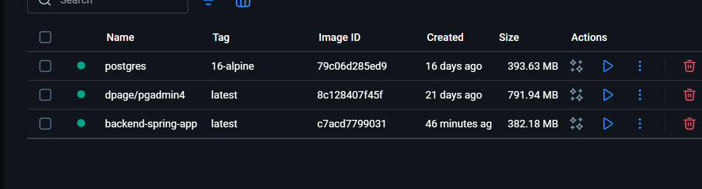

*Figura 9-2. Listado de volúmenes Docker persistentes*

### 3. Conectividad entre servicios verificada

- La aplicación backend se conecta exitosamente a PostgreSQL usando el nombre de servicio `postgres`
- pgAdmin puede administrar la base de datos usando el nombre de servicio interno
- Todos los servicios están en la red `backend-network`


*Figura 9-3. Inspección de la red Docker mostrando los tres servicios conectados*

### 4. Base de datos configurada y funcional

- Base de datos `security_db` creada automáticamente
- Migraciones de Flyway ejecutadas correctamente
- Tablas de la aplicación creadas y accesibles desde pgAdmin


*Figura 9-4. Vista de pgAdmin mostrando la base de datos y sus tablas*


### 5. Health checks funcionando

- Los servicios reportan su estado de salud correctamente
- Docker puede reiniciar automáticamente contenedores no saludables
- Orden de inicio garantizado mediante dependencias

```cmd
docker inspect --format='{{.State.Health.Status}}' spring-backend
# Output: healthy
```

### 7. Aplicación completamente funcional

- Endpoints de la aplicación responden correctamente
- Operaciones CRUD funcionan con la base de datos
- Actuator health endpoint reporta estado "UP"

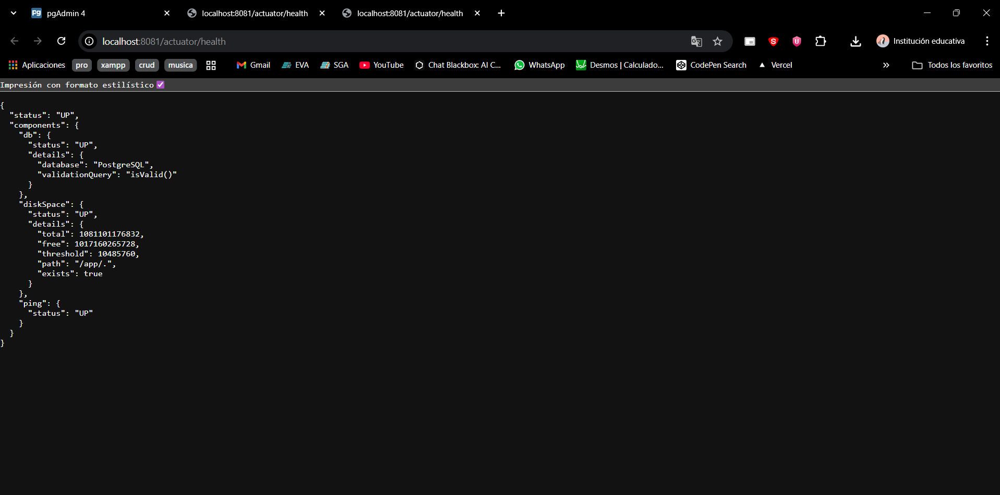

*Figura 9-6. Respuesta JSON del endpoint de health mostrando estado UP*

### 8. Automatización completa

- **Un solo comando levanta toda la infraestructura**: `docker-compose up -d`
- Variables de entorno centralizadas en archivo `.env`
- Configuración reproducible en cualquier máquina con Docker

### 9. Arquitectura final

```
┌─────────────────────────────────────────────────┐
│           Red: backend-network                  │
│                                                 │
│  ┌──────────────┐  ┌──────────────┐  ┌────────┐ │
│  │   Backend    │  │  PostgreSQL  │  │pgAdmin │ │
│  │ Spring Boot  │──│   Database   │──│ Panel  │ │
│  │   :8081      │  │    :5432     │  │ :5050  │ │
│  └──────────────┘  └──────────────┘  └────────┘ │
│         │                  │              │     │
│         └──────────────────┴──────────────┘     │
│                   Volúmenes                     │
│         postgres-data    pgadmin-data           │
└─────────────────────────────────────────────────┘
```
*Figura 9-7. Diagrama de arquitectura final del sistema desplegado*

## 10. Bibliografía

- Docker Inc. (2024). *Docker Documentation*. Recuperado de https://docs.docker.com/

- Docker Inc. (2024). *Overview of Docker Compose*. Recuperado de https://docs.docker.com/compose/

- Docker Inc. (2024). *Best practices for writing Dockerfiles*. Recuperado de https://docs.docker.com/develop/develop-images/dockerfile_best-practices/

- Docker Inc. (2024). *Use multi-stage builds*. Recuperado de https://docs.docker.com/build/building/multi-stage/

- PostgreSQL Global Development Group. (2024). *PostgreSQL Documentation*. Recuperado de https://www.postgresql.org/docs/

- The pgAdmin Development Team. (2024). *pgAdmin Documentation*. Recuperado de https://www.pgadmin.org/docs/

- Pivotal Software. (2024). *Spring Boot with Docker*. Spring Guides. Recuperado de https://spring.io/guides/gs/spring-boot-docker/